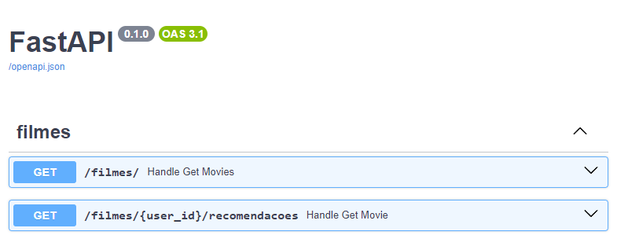
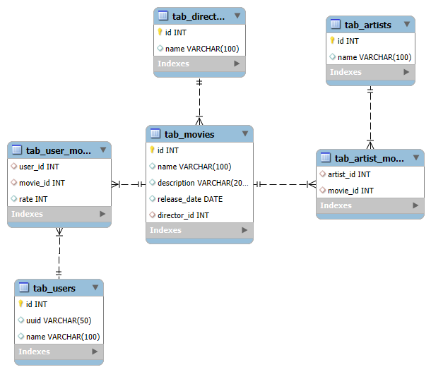

# Sistema de Recomendação de Filmes

O projeto implementa uma aplicação para gerenciamento dos dados de uma plataforma de streaming de filmes e para recomendação de filmes com base na avaliação e preferências dos usuários. A aplicação foi escrita utilizando a linguagem Python, framework FastAPI e banco de dados MySQL.

### Guia para utilização

##### Rodar o Projeto

Foi utilizada a versão 3.12.5 do Python, que pode ser baixado na [página oficial](https://www.python.org/downloads/).

O código está disponível no github. Para baixar, clone o repositório com o comando:

```
git clone https://github.com/NeliocmSampaio/movies-recomendation-system.git
```

As bibliotecas utilizadas estão listadas no arquivo **movies-recomendation-system/src/requirements.txt**. Para instalá-las, rode o comando de dentro da pasta src:

```
pip install -r ./src/requirements.txt
```

Para rodar o projeto, rode o comando:

```
uvicorn src.main:app --reload
```

##### Swagger

Com o projeto rodando a documentação pode ser encontrada no endereço: **http://127.0.0.1:8000/docs#/**.



##### Banco de dados

A estrutura do banco de dados é gerada a partir dos modelos, as credenciais devem ser inseridas no arquivo de configuração **movies-recomendation-syste/src/core/config.py**. Caso vá rodar o projeto localmente, instale o [MySQL](https://www.mysql.com/downloads/), crie o banco de dados e configure a conexão.

O arquivo **movies-recomendation-system/sql/insert_test_values.sql** contém as queries SQL para inserir dados para teste.

### Arquitetura

A arquitetura da aplicação se baseia numa estrutura baseada no domínio (DDD) simplificada. Essa abordagem foi escolhida pela baixa complexidade do projeto e do framework [FastAPI](https://fastapi.tiangolo.com/). 

```
└── 📁src                   
    └── 📁api               # Endpoints da aplicação e modelos das requisições.
        └── 📁controllers
        └── 📁requests
    └── 📁core              # Arquivos de configuração
    └── 📁crud              # Operações CRUD para os modelos de filme, usuario, diretor e artista.
    └── 📁domain            # Domínio da aplicação. Contém a lógica de recomendação e interação entre as entidades.
        └── 📁entities
        └── 📁services
    └── 📁infrastructure    # Contém as integrações externas (atualmente apenas o banco de dados).
        └── 📁db
            └── 📁models    # Define os modelos (tabelas) do banco de dados e suas relações.
    └── 📁schemas           # Classes intermediárias utilizadas na comunicação entre camadas.
```

### Modelagem do Banco de dados

O banco de dados foi modelado a partir de uma tabela central **tab_movies** que, além de conter informações sobre o filme, tem relação **1:1** com a tabela **tab_directors** e **N:N** com as tabelas **tab_users** e **tab_artists**. O diagrama a seguir ilustra o banco de dados.



O esquema utilizado permite que a aplicação armazene as informações de usuários, artistas e diretores independente dos filmes, mantendo uma estrutura mais limpa e escalável.

#### Dados

Os dados utilizados durante o desenvolvimento foram criados de forma sintética. Para aperfeiçoamento do modelo é necessário partir de uma base com dados sólidos e possivelmente orgânicos para o case específico. Uma alternativa encontrada durante as pesquisas é a base [movielens](https://grouplens.org/datasets/movielens/), que precisa ser estruturada para esse modelo.

### Sistema de Recomendação

O modelo utilizado para recomendação se baseia na recomendação por filtragem colaborativa utilizando similaridade de cossenos para cálculo da matriz de predição. Esse modelo faz o cálculo com base apenas na avaliação do usuário, sendo necessária uma abordagem híbrida que possa levar em consideração artistas e diretor de cada filme, e posteriormente outras características como gênero.

### Requisitos

#### Funcionais

- [x]  O sistema deve ser capaz de recomendar filmes semelhantes aos que o usuário já assistiu.
- [x]  Os usuários devem poder avaliar os filmes (estrelas ou likes).
- [ ]  A recomendação deve levar em consideração:
    - [x]  Filmes assistidos pelo usuário
    - [x]  Avaliações dadas pelo usuário
    - [ ]  Genero dos filmes
    - [ ]  Diretores e artistas

#### Não Funcionais

- [x]  Deve conter os seguintes endpoints:
    - [x]  **/filmes**: Retorna a lista de todos os filmes disponíveis.
    - [x]  **/filmes/{usuario_id}/recomendacoes**: Retorna as recomendações personalizadas para o usuário com o ID especificado.


### Próximos Passos

- Criação de uma base de dados mais consistente para a aplicação. A base [movielens](https://grouplens.org/datasets/movielens/) disponibiliza dados que podem se encaixar para a aplicação, mas que precisa de tratamento para se encaixar no modelo criado.

- Implementação de abordagem híbrida para recomendação de filmes.

- Implementação de operações CRUD para diretores e artistas.

- Implementação de testes unitários.

- Adicionar outras características dos filmes ao modelo (tratamento da descrição, gênero, comentários, etc.)